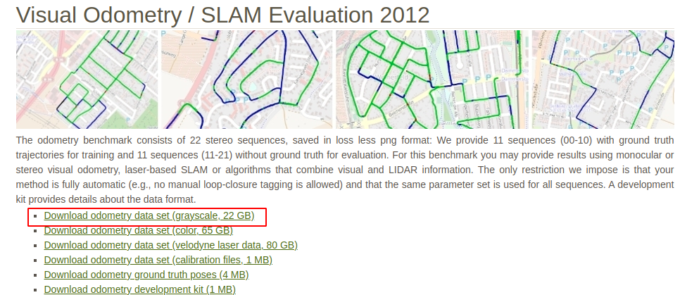

# MLK-SLAM


该项目构建了一种基于多层光流法的前端和滑动窗口后端BA的简单slam系统，主要借鉴了《视觉slam十四讲》的内容。

系统的运行效果如下所示：

<div align="center">
	<a href="https://www.youtube.com/watch?v=6GFBdjZPgTg" title="youtube:MLK-SLAM">
		
	</a>
</div>

## 特征

- 前端采用多层光流法，用于特征匹配
- 后端采用了基于滑动窗口的BA
- 与《视觉slam十四讲》不同的是
  - 前端线程并不会等待后端线程运行结束
  - 使用Pangolin渲染图片，而不是使用OpenCV
  - 使用更常用的json作为配置文件，而不是yml
  - 使用更轻量的spdlog作为日志输出库，而不是glog

## 文档
详细的项目api文档：<a>https://sunshanlu.github.io/mlk-graph-slam/</a>

## 依赖
- [vcpkg install(可选)](https://github.com/microsoft/vcpkg)
- [cmake 3.16+](https://cmake.org/)

## 数据集
项目使用的是：[KITTI数据集](https://www.cvlibs.net/datasets/kitti/eval_odometry.php)，需下载如下图所示的数据集文件：
<div align="center">
    
</div>


## 安装

文档提供两种安装项目依赖的方式
- 通过vcpkg包管理工具安装（推荐）
- 通过手动下载依赖包进行安装

方式一：采用[vcpkg包管理工具](https://github.com/microsoft/vcpkg)安装依赖

需要去vcpkg的github主页进行vcpkg管理工具的安装
```shell
mkdir build
cd build
cmake .. -DCMAKE_TOOLCHAIN_FILE="[vcpkg root]/scripts/buildsystems/vcpkg.cmake"
cmake --build . -j10
```

方式二：手动下载依赖包进行安装
- [OpenCV – 3.4.16](https://opencv.org/releases/)
- [fmt - 8.1.0](https://github.com/fmtlib/fmt/releases/tag/8.1.0)
- [spdlog - 1.10.0](https://github.com/gabime/spdlog/releases/tag/v1.10.0)
- [jsoncpp - 1.9.5](https://github.com/open-source-parsers/jsoncpp/releases/tag/1.9.5)
- [g20 - 2023-02-23](https://github.com/RainerKuemmerle/g2o/releases/tag/20230223_git)
- [eigen - 3.4.0](https://gitlab.com/libeigen/eigen/-/releases)

注意，采用第二种方式进行项目依赖库的安装的话，需要修改`cmake/FindG2O.cmake`文件的内容。将 https://github.com/gaoxiang12/slambook2/blob/master/ch13/cmake_modules/FindG2O.cmake 的`FindG2O.cmake`内容替换到`cmake/FindG2O.cmake`中即可。

```shell
mkdir build
cd build
cmake ..
buildsystems/vcpkg.cmake"
cmake --build . -j10
```

## 运行

配置文件config.json中的变量含义如下：
```shell
# config/config.json
KITTI_PATH                    KITTI数据集地址
DETECT_FEATURE_NUM            征检测数目
MAX_ACTIVE_KEYFRAME_NUM       Map中m_activeFrames的数目
KEYFRAME_DISTANCE_TH          保证Map::m_activeFrames的距离大于0.5
EDGE_CHI2_TH                  优化边的阈值
OUTLIER_DETECT_ITERATIONS     进行异常点检测的优化迭代次数
OPTIMIZE_ITERATIONS           单次优化迭代次数
TRACK_GOOD_TH                 track good 阈值
TRACK_BAD_TH                  track bad 阈值
MIN_MAPPOINTS_NUM_FOR_TRACK   track可执行的最少特征数目
MAPPOINT_SIZE                 定义绘制地图点的大小
LINE_WIDTH                    定义绘制线断的大小
CURR_FRAME_COLOR              定义绘制当前帧的颜色
MAPPOINT_COLOR                定义绘制地图点的颜色
MAP_FRAME_COLOR               定义绘制激活关键帧的颜色
FEATURE_COLOR                 定义绘制特征点的颜色 
```
- 项目编译完成后记得将`KITTI_PATH`的默认值修改到你电脑上的路径
- 其他参数可以保持不变，也可以根据你的理解自行修改
- 运行`build/mlk-slam`可执行文件即可


## LICENSE

该项目的代码是根据[MIT License](./LICENSE)许可证授权的。如需引用，请说明出处。